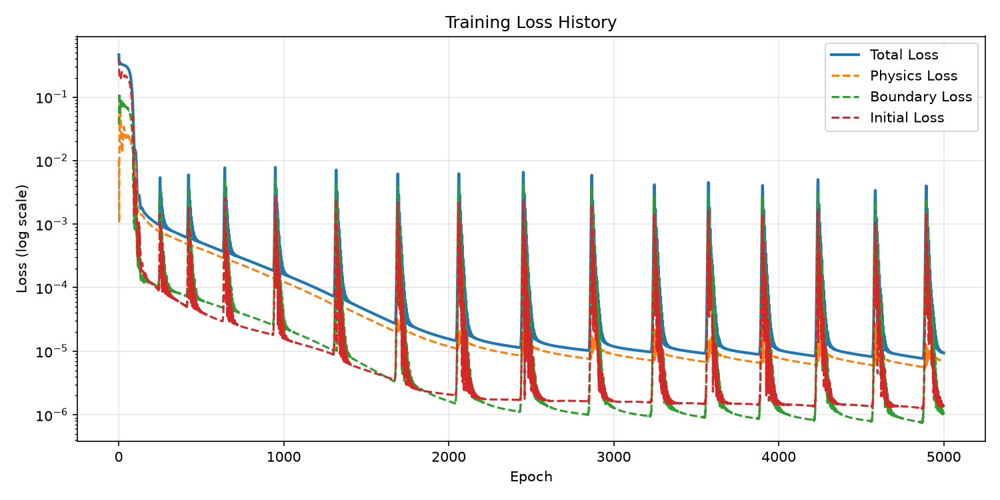
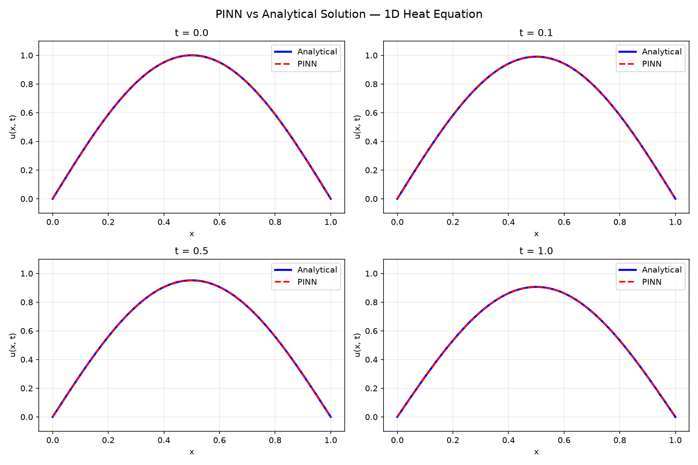
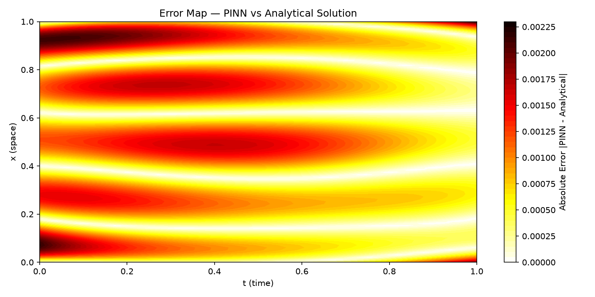

# Physics-Informed Neural Network — 1D Heat Equation

A neural network that learns to solve the 1D heat equation by respecting the underlying physics — without any labeled solution data. Built with PyTorch from scratch.

## The Problem

The 1D heat equation describes how temperature distributes over time:

$$\frac{\partial u}{\partial t} = \alpha \frac{\partial^2 u}{\partial x^2}$$

Where:
- $u(x, t)$ = temperature at position $x$ and time $t$
- $\alpha = 0.01$ = thermal diffusivity constant
- $x \in [0, 1]$, $t \in [0, 1]$

**Boundary conditions:** $u(0, t) = 0$, $u(1, t) = 0$

**Initial condition:** $u(x, 0) = \sin(\pi x)$

**Analytical solution:** $u(x, t) = e^{-\alpha \pi^2 t} \sin(\pi x)$

## What is a PINN?

A Physics-Informed Neural Network (PINN) is a neural network trained to satisfy a partial differential equation. Instead of learning from labeled data, it minimizes a loss function composed of three terms:

- **Physics loss** — penalizes violation of the PDE at random collocation points
- **Boundary loss** — enforces boundary conditions at $x=0$ and $x=1$
- **Initial loss** — enforces the initial temperature profile $u(x,0) = \sin(\pi x)$

The key insight: PyTorch autograd computes exact derivatives of the network output with respect to inputs, enabling automatic differentiation of the PDE residual.

## Architecture

- 4 fully connected layers, 64 neurons each
- Tanh activations (smooth, infinitely differentiable — required for PDE derivatives)
- 8,577 trainable parameters
- Trained with Adam optimizer, 5000 epochs

## Results

| Metric | Value |
|---|---|
| Final total loss | 0.000009 |
| Max absolute error | 0.002254 |
| Mean absolute error | 0.000846 |
| Training time | ~3 minutes (CPU) |

### Loss History


### PINN vs Analytical Solution


### Error Map


## Project Structure

pinn-heat-equation/
├── src/
│   ├── model.py        # Neural network architecture
│   ├── data.py         # Training data generation
│   ├── losses.py       # Physics, boundary, initial losses
│   ├── train.py        # Training loop
│   └── visualize.py    # Plots and accuracy report
├── outputs/            # Generated plots
├── main.py             # Full pipeline entry point
└── requirements.txt    # Dependencies

## Run it yourself

```bash
git clone https://github.com/rkazumovi/pinn-heat-equation.git
cd pinn-heat-equation
python -m venv venv
venv\Scripts\activate
pip install -r requirements.txt
python main.py
```

## Key Concepts

**Why not just use a numerical solver?**
Traditional methods like finite difference or finite element require a discrete mesh. PINNs are mesh-free, naturally handle irregular domains, and can incorporate noisy observational data alongside physics constraints.

**Why Tanh over ReLU?**
PINNs require computing second-order derivatives of the network output. ReLU's second derivative is zero everywhere, making physics loss computation impossible. Tanh is smooth and infinitely differentiable.

**Mathematical foundation:**
The physics loss minimizes the PDE residual computed via automatic differentiation through PyTorch autograd.